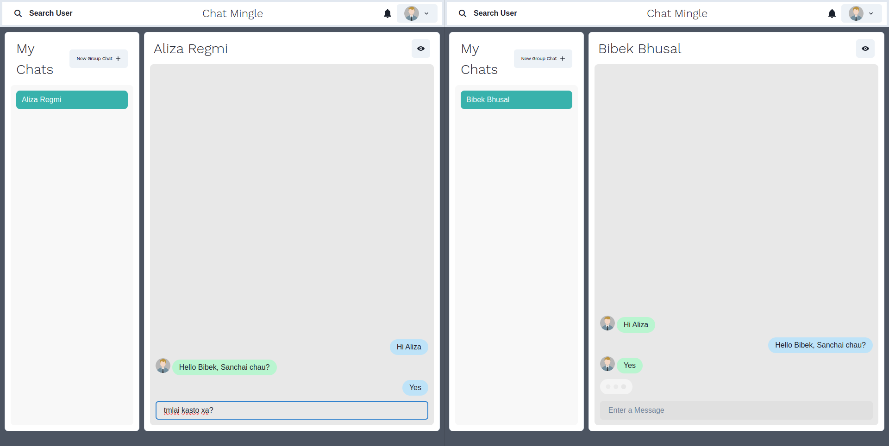
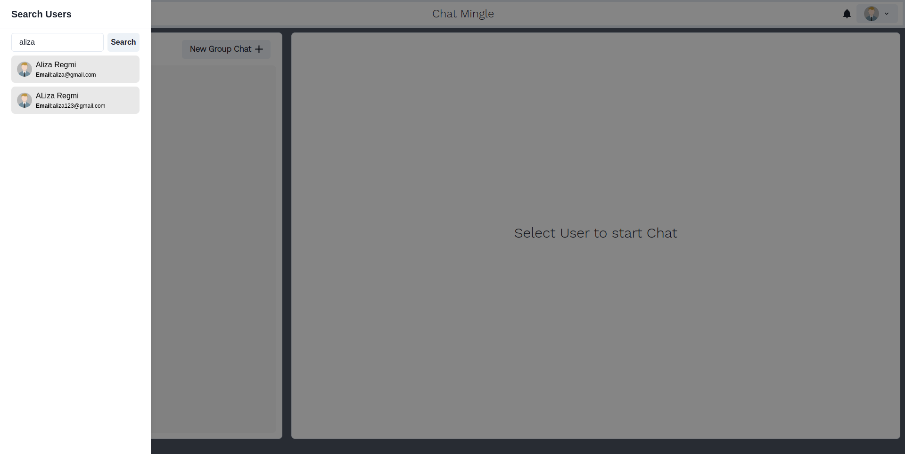
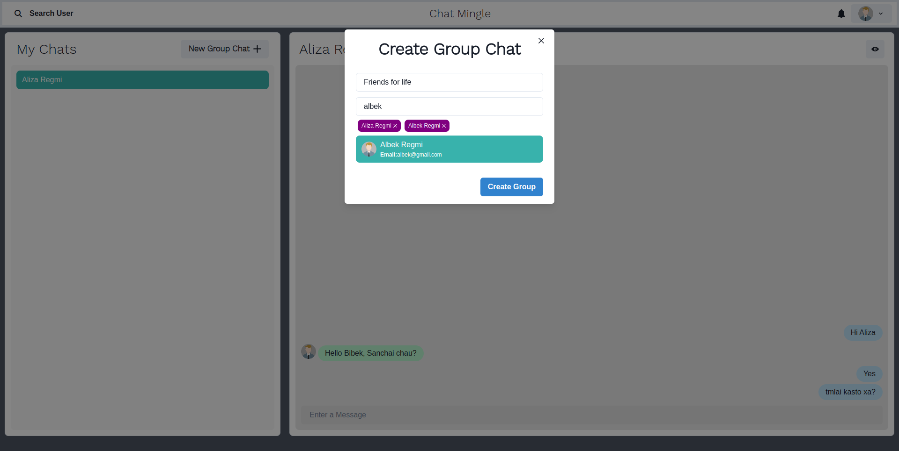
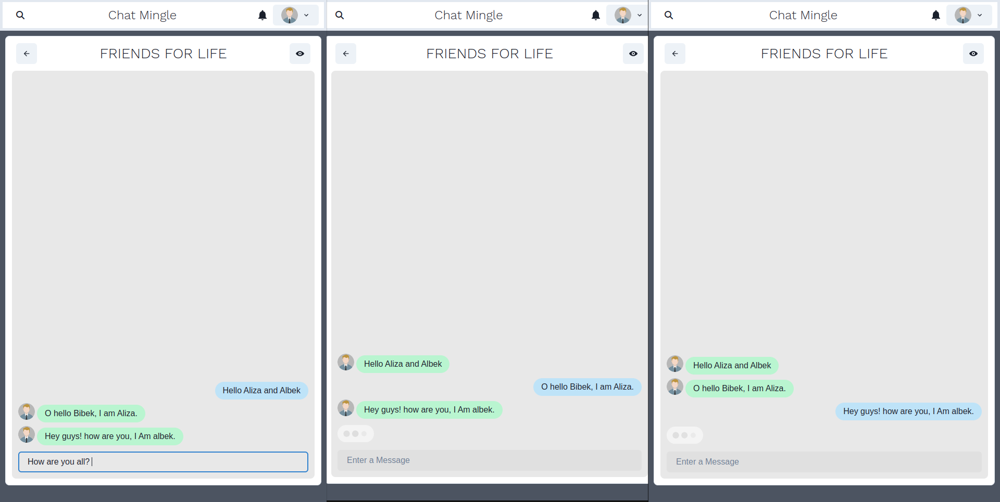

[](https://wakatime.com/badge/user/558bdd52-529b-4833-baae-cac62f99ff8a/project/8b71d70c-ce97-4460-a757-92797680e5fd)

# ChatMingle 🚀

Welcome to ChatMingle, the ultimate chat app built using the MERN stack with real-time messaging powered by Socket.io! ChatMingle allows you to connect with friends, family, or anyone around the world seamlessly.

## Screenshots







## Features

- Real-time messaging
- User authentication
- MERN stack architecture
- Sleek and intuitive user interface

## Get Started

1. Clone the repository.
2. Install dependencies for both backend and frontend.
3. Start the backend server.
4. Start the frontend server.
5. Open your browser and navigate to `http://localhost:3000`.
6. Start chatting and mingle with others!


## Clone the Repository

```bash
git clone https://github.com/Bibker/ChatMingle.git
```

## Installation

### Frontend

```bash
cd ChatMingle/frontend
npm install
npm start
```
### Backend

```bash
cd ChatMingle
npm install
npm start
```